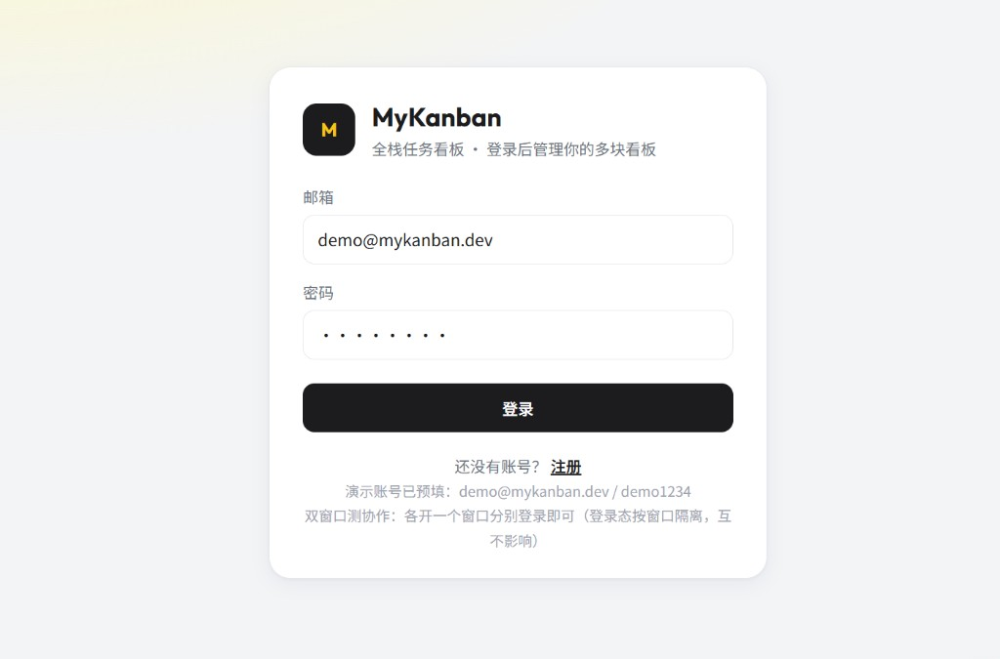
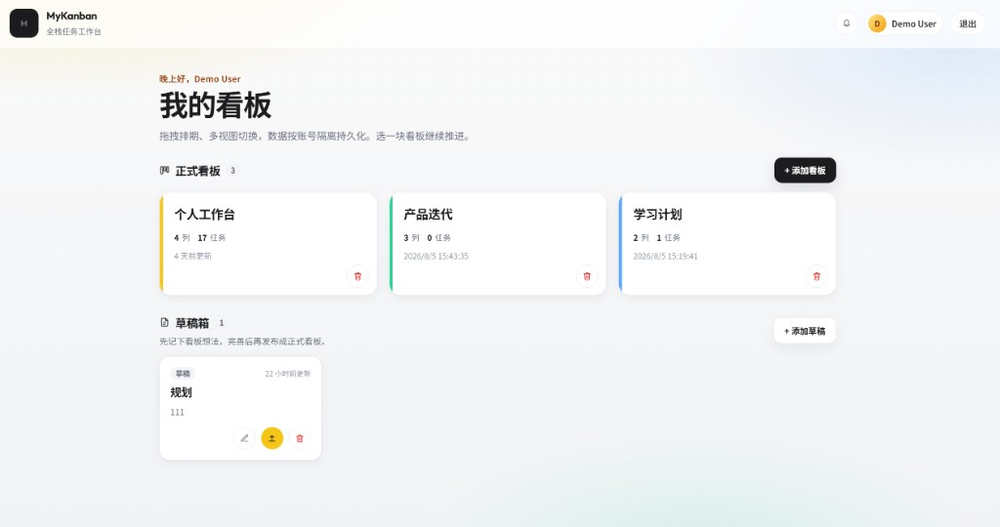
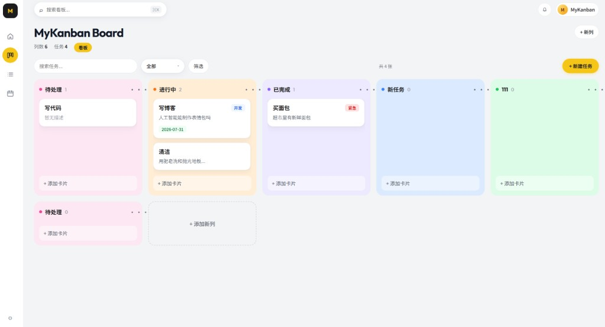
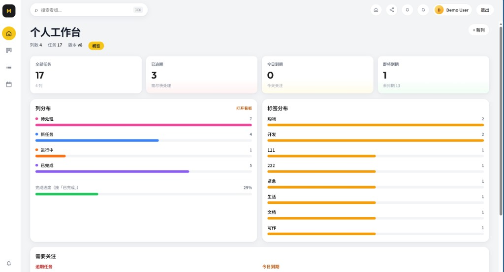
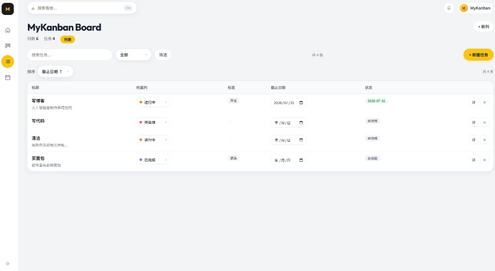
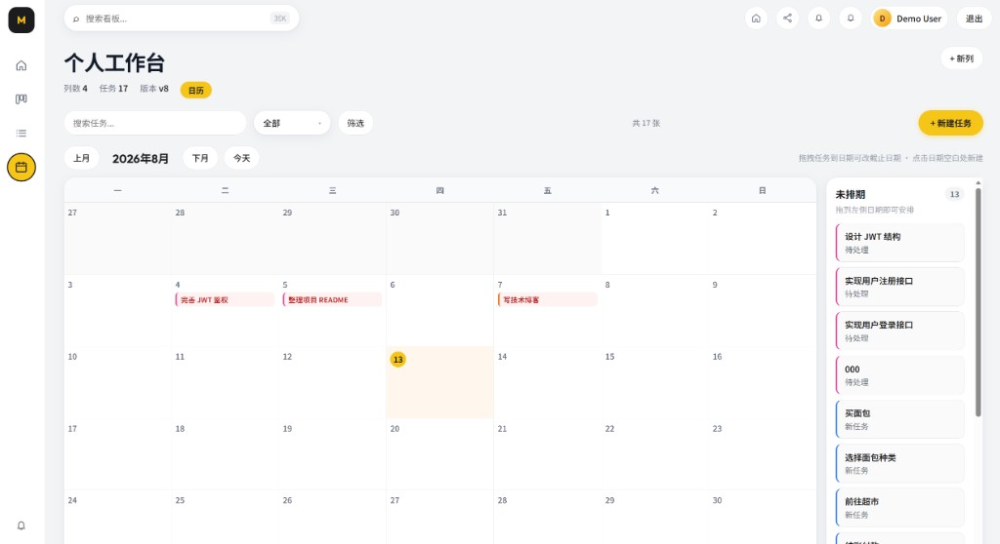

# MyKanban · React Kanban Board

面向个人与小团队的轻量全栈看板：多视图拖拽排期、草稿箱、协作分享与可选板内 AI。

**技术栈** React 19 · Vite 7 · Express 5 · MySQL · Redis · JWT · WebSocket  
**仓库** [Zhoupy0608/react-kanban-board](https://github.com/Zhoupy0608/react-kanban-board)

前后端同进程启动：开发时内嵌 Vite HMR，生产时托管 `dist/`。默认依赖 **MySQL + Redis**（可用 Docker Compose 一键拉起）。

---

## 目录

- [功能一览](#功能一览)
- [快速开始](#快速开始)
- [界面预览](#界面预览)
- [使用提示](#使用提示)
- [配置说明](#配置说明)
- [API 摘要](#api-摘要)
- [架构与目录](#架构与目录)
- [部署](#部署)
- [常见问题](#常见问题)

---

## 功能一览

| 模块 | 说明 |
| --- | --- |
| 账号 | 注册 / 登录 / 个人页（昵称、邮箱）/ 退出作废 Token |
| 看板 | 正式看板 + **草稿箱**（想法暂存，一键发布） |
| 多视图 | 概览 · 看板 · 列表 · 日历 |
| 交互 | 跨列拖拽、列重排、列宽高本地记忆 |
| 卡片 | 标签、截止日期、清单、优先级、评论与 @提及 |
| 协作 | 成员邀请（editor / viewer）、WebSocket 实时同步、通知中心 |
| AI（可选） | 列内注入、描述润色、拆分任务 / 清单（OpenAI 兼容接口） |
| 工程 | MySQL schema 自动建表、乐观锁、健康检查、GitHub Actions CI |

---

## 快速开始

**环境：** Node.js 18+（推荐 22）、Docker（或本机已有 MySQL 8 + Redis 7）

```bash
git clone https://github.com/Zhoupy0608/react-kanban-board.git
cd react-kanban-board
npm install
cp .env.example .env
npm run docker:up    # 启动 MySQL + Redis
npm start            # http://localhost:5000
```

健康检查：[`http://localhost:5000/api/health`](http://localhost:5000/api/health)  
期望看到 `"dbDriver":"mysql"`、`"redis":"connected"`。

### 演示账号

| 邮箱 | 密码 | 说明 |
| --- | --- | --- |
| `demo@mykanban.dev` | `demo1234` | 主演示账号 |
| `collab@mykanban.dev` | `demo1234` | 协作演示（需先被邀请） |

首次启动会自动建表并写入演示数据。

> **清空数据：** `docker compose down -v` → `npm run docker:up` → `npm start`  
> **Redis：** 默认必连；仅应急可设 `REDIS_OPTIONAL=1`（不推荐）。

### 常用命令

| 命令 | 说明 |
| --- | --- |
| `npm run docker:up` / `docker:down` | 启停 MySQL + Redis |
| `npm start` / `npm run dev` | 开发模式（Express + Vite HMR，端口 5000） |
| `npm run build` | 构建前端到 `dist/` |
| `npm run start:prod` | 生产模式（静态 `dist`） |
| `npm test` | API 测试（需 MySQL / Redis 已就绪） |
| `npm run migrate` | 查看 MySQL schema 版本是否对齐 |
| `npm run share` | cpolar 公网临时分享（Windows） |

---

## 界面预览

| 登录 | 看板列表 |
| :---: | :---: |
|  |  |

| 看板视图 | 概览 |
| :---: | :---: |
|  |  |

| 列表 | 日历 |
| :---: | :---: |
|  |  |

---

## 使用提示

- **草稿箱**：列表页下方添加草稿，完善后「发布」成带默认三列的正式看板。
- **个人页**：顶栏用户胶囊进入，可改昵称 / 邮箱。
- **双窗口协作**：登录态在 `sessionStorage`，窗口互不影响；分别登录 demo / collab 即可联调。
- **板内 AI**：在 `.env` 配置 `AI_API_KEY`（及可选 `AI_BASE_URL` / `AI_MODEL`）。国内模型一般无需 `AI_HTTP_PROXY`。

---

## 配置说明

完整模板见 [`.env.example`](.env.example)。

### 安全要点

- 生产环境未配置 `JWT_SECRET` 时**拒绝启动**
- 登录 / 注册按 IP 限流；生产建议配置 `CORS_ORIGINS`
- 退出登录递增 `token_version`，旧 JWT 立即失效
- WebSocket 使用短时 ticket，避免长期 token 出现在 URL

### 主要环境变量

| 变量 | 说明 |
| --- | --- |
| `PORT` / `HOST` | 默认 `5000` / `0.0.0.0` |
| `DB_DRIVER` | 固定 `mysql`（已移除 SQLite） |
| `MYSQL_HOST` / `PORT` / `USER` / `PASSWORD` / `DATABASE` | MySQL 连接（与 compose 默认一致） |
| `REDIS_URL` | 例如 `redis://127.0.0.1:6379` |
| `REDIS_OPTIONAL` | `1` 时跳过 Redis（应急） |
| `BOARD_CACHE_TTL_SEC` | 整板读缓存 TTL（秒） |
| `JWT_SECRET` | JWT 签名密钥（**生产必须**） |
| `CORS_ORIGINS` | 允许的 Origin，逗号分隔 |
| `AI_API_KEY` | 板内 AI；未设置时 AI 接口返回 503 |
| `AI_BASE_URL` / `AI_MODEL` | OpenAI 兼容地址与模型名 |
| `AI_HTTP_PROXY` | 仅 AI 出网代理（可选） |

---

## API 摘要

鉴权请求头：`Authorization: Bearer <token>`

| 方法 | 路径 | 鉴权 | 说明 |
| --- | --- | --- | --- |
| `GET` | `/api/health` | 否 | 健康检查（`schemaVersion`、`dbDriver`、`redis`、`features`） |
| `POST` | `/api/auth/register` · `/login` | 否 | 注册 / 登录 |
| `GET` · `PATCH` | `/api/auth/me` | 是 | 当前用户 / 更新资料 |
| `POST` | `/api/auth/logout` · `/ws-ticket` | 是 | 退出 · WS 短时票据 |
| `GET` · `POST` | `/api/boards` | 是 | 看板列表 / 创建 |
| `GET` · `PUT` | `/api/boards/:id/full` | 是 | 整板读写（乐观锁） |
| `GET` · `POST` · `PATCH` · `DELETE` | `/api/drafts` | 是 | 草稿 CRUD |
| `POST` | `/api/drafts/:id/publish` | 是 | 草稿发布为看板 |
| `*` | `/api/boards/:id/members` 等 | 是 | 成员 / 评论 / 活动 |
| `*` | `/api/notifications` | 是 | 通知 |
| `POST` | `/api/ai/*` | 是 | 板内 AI（需密钥） |

WebSocket：`/ws?ticket=...&boardId=...`（先 `POST /api/auth/ws-ticket`）

---

## 架构与目录

```text
浏览器 (React)
  ├─ REST  /api/*          → Express → MySQL
  ├─ Cache / 限流          → Redis
  └─ WS    /ws             → 实时协作
```

数据模型（MySQL schema **v8**，启动时执行 `server/migrations/mysql/schema.sql`）：

```text
users → boards → lanes → cards
     ↘ board_drafts
     ↘ board_members → comments / notifications / activity_events
```

```text
.
├── server.js                 # 入口：API + WebSocket + Vite / dist
├── docker-compose.yml        # 本地 MySQL 8.4 + Redis 7
├── server/
│   ├── createApp.js          # Express 组装
│   ├── auth.js · collab.js · realtime.js · ai.js
│   ├── db.js · db/mysql.js · redis.js · cache.js
│   ├── migrations/mysql/     # schema.sql（当前 v8）
│   └── routes/               # auth · boards · drafts · notifications · ai
├── src/
│   ├── pages/                # 登录、列表、个人页、看板工作区
│   ├── components/           # 列、抽屉、多视图、分享、通知、AI
│   ├── hooks/                # useKanban · useRealtime
│   ├── context/AuthContext.jsx
│   └── services/api.js
├── tests/                    # Vitest + Supertest
├── scripts/migrate.mjs       # schema 版本查询
└── .github/workflows/ci.yml
```

查看版本对齐：`npm run migrate`（即 `node scripts/migrate.mjs status`）。

---

## 部署

| 方式 | 说明 |
| --- | --- |
| **Render** | 见 [`render.yaml`](render.yaml)；配置 `JWT_SECRET`、`MYSQL_*`、`REDIS_URL` |
| **Docker** | 见 [`Dockerfile`](Dockerfile)；编排侧注入 `JWT_SECRET`、`MYSQL_*`、`REDIS_URL` |
| **本地生产** | `npm run start:prod`（先保证 MySQL / Redis 可达） |

---

## 常见问题

**登录后 401？**  
Token 过期或未带 `Authorization`，重新登录即可。

**启动报 MySQL / Redis 连接失败？**  
先 `npm run docker:up`，确认 `.env` 中 `MYSQL_*` / `REDIS_URL` 正确，再看 `/api/health`。

**本机没有 Docker？**  
自行提供 MySQL 8 与 Redis 7，在 `.env` 填写对应连接信息即可。

**想恢复演示数据？**  
`docker compose down -v && npm run docker:up && npm start`。

**板内 AI 返回 503？**  
未配置 `AI_API_KEY` 时为预期行为；配好密钥后重启服务。
